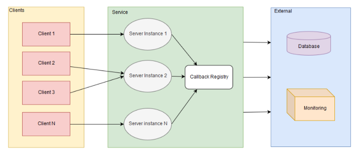

# David Ryan Portfolio

***
# Projects
***
## Game Object Request Broker (Gorb)
Gorb is my Final Year Project for my undergraduate degree in Computer Games Development from University of Limerick. It is a framework for storing and retrieving serialized game objects at runtime. The project consists of several components:
* An RPC server for storing and retrieving serialized binary objects from a database
* A standalone CLI client for converting OBJ files to a custom format and uploading them to the server
* Monitoring and Dashboards
* An Unreal Engine plugin providing an Actor which downloads its mesh from the server at run time
* An Unreal Engine demo project for showcasing this Actor in action

#### Languages
* C++ (Server, Tests, Unreal plugin and project)
* Go (convert-obj command-line interface)

#### Technologies
* Docker, CMake, Visual Studio, Unreal Editor, MySQL, Cap'n Proto, Prometheus, Grafana

#### Links
* [Github Repository](https://github.com/david159ryan/gorb)
* [FYP Report](https://github.com/david159ryan/gorb/raw/master/docs/FYP%20Final%20Report.pdf) (PDF Download)
#### Video Demonstration
The demo below showcases the following features of the project:
* Starting the server
* Converting OBJ files to a custom Cap'n Proto format
* Uploading these files to the server
* Creating a Dynamic Runtime Mesh Actor
* Assigning the Actor a UUID to tell it which mesh to download at runtime
* Actor being updated with its new mesh immediately when it is modified on the server

**Fullscreen Recommended**
<iframe width="600" height="480"
src="https://www.youtube.com/embed/gLKK8iTEaXI?autoplay=0&cc_load_policy=1&rel=0&showinfo=0"
frameborder="0" allowfullscreen>
</iframe> 

***
## Trash Team Racing
Trash Team Racing was created for the GamesFleadh 2017 Game Studio Ireland Competion. I worked on this game alongside Joseph Greaney, David Ryley, Chris Brady, and Shane O'Malley. The game won both the "College Champions" and "Best in Animation" awards.

The game was made using the Unity game engine. All assets, art, audio, animations and models were made from scratch.

#### Description

Choose your team: Trash or Flash, and take control of your little robot who must race around your hovership, activating and refueling components in order to keep the ship running and win the race!
Play by yourself, with a friend, against a friend or 2 v 2 in this fast paced racing game inspired by FTL and Mad Max.

  
   

#### Video Demonstration
<iframe width="600" height="480"
src="https://www.youtube.com/embed/AudlKPztwJk?autoplay=0&cc_load_policy=1&rel=0&showinfo=0"
frameborder="0" allowfullscreen>
</iframe> 

***
## Boom
BOOM is an isometric dungeon runner game of Speed and Punishment. It was developed alongside David Ryley and Chris Brady using Corona SDK as a part of our Games Modelling and Design module.
#### Links
* [Github Repository](https://github.com/dwarfplumber/BOOM)
* [Game Design Doc](https://github.com/dwarfplumber/BOOM/blob/master/BOOM/GDD/BOOM_DD.pdf)
#### Video Demonstration
<iframe width="800" height="480" src="https://www.youtube.com/embed/4kTkj26uckg?autoplay=0&cc_load_policy=1&rel=0&showinfo=0" frameborder="0" allowfullscreen></iframe>

***
## Spectro
4th Year project for benchmarking pathfinding algorithms in Unity. Made as part of the Computer Games Development course in University of Limerick, Ireland.

#### Video Demonstration
<iframe width="800" height="480" src="https://www.youtube.com/embed/q_F0A4gU0dY?autoplay=0&cc_load_policy=1&rel=0&showinfo=0" frameborder="0" allowfullscreen></iframe>

***
## Grave Mistake

Grave Mistake is a 2nd year project made using the Skyrim Creation Kit. It was designed as a standalone game made using Skyrim's assets and tools.

#### Description

You're a grave robber trying to find treasure inside a graveyard full of statues, only one of the statues has been possessed by the soul of a serial killer and is out to murder you. This possessed statue will only move when it is out of your line of sight, and being in a graveyard full of statues, you have no idea which one it is!! Can you find your treasure before the killer finds you? Queue dramatic horror music...

<iframe width="800" height="480" src="https://www.youtube.com/embed/NV_4raFyGaE?autoplay=0&cc_load_policy=1&rel=0&showinfo=0" frameborder="0" allowfullscreen></iframe>